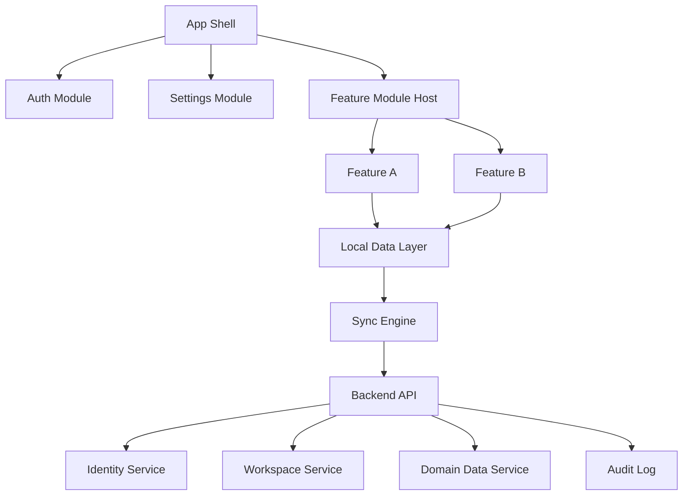

# Reusable App Frameset Architecture

## Goals

Build a reusable app foundation for many product ideas:

- Android and iOS first, optional web
- Offline-first local storage
- Optional cloud sync for signed-in users and teams
- Authentication, login, settings, permissions, and security as reusable core modules
- Feature modules that can interact on demand without tight coupling
- Clear module boundaries so each app can reuse the same frame and add its own domain features

## Recommended Stack

For maximum reuse across Android, iOS, and web:

- Client: Flutter, React Native, or Kotlin Multiplatform with native UI
- Web: Flutter Web, React/Next.js, or shared TypeScript modules where practical
- Local database: SQLite via Drift/Room/SQLDelight, or Realm
- Sync transport: HTTPS REST plus optional WebSocket/SSE for live updates
- Backend: Node.js/NestJS, Kotlin/Spring, Go, or .NET
- Cloud database: PostgreSQL
- Cache/queue: Redis plus background workers
- Object storage: S3-compatible storage for files

## High-Level Architecture



## Client Layers

1. Presentation layer
   - Screens, navigation, forms, theming, localization, accessibility
   - Owns UI state only

2. Application layer
   - Use cases and workflows
   - Coordinates modules
   - Applies permission checks before actions

3. Domain layer
   - App-specific business entities
   - Validation rules
   - Domain events

4. Data layer
   - Local repositories
   - Sync repositories
   - Mappers between local, domain, and API models

5. Infrastructure layer
   - Local database
   - Secure storage
   - HTTP client
   - File storage
   - Push notifications
   - Telemetry

## Core Modules

### App Shell

Responsibilities:

- App startup
- Dependency injection
- Navigation
- Theme and localization loading
- Module registration
- Feature flags
- Global error handling

Suggested interface:

```ts
interface AppModule {
  id: string;
  version: string;
  routes?: RouteDefinition[];
  permissions?: PermissionDefinition[];
  register(container: ServiceContainer): void;
  onAppStart?(context: AppContext): Promise<void>;
  onWorkspaceChanged?(workspaceId: string | null): Promise<void>;
}
```

### Authentication Module

Responsibilities:

- Login, logout, registration
- Password reset
- Token refresh
- Session state
- Optional social login / passkeys / SSO
- Guest/offline mode

States:

- `anonymous`
- `localOnly`
- `authenticated`
- `sessionExpired`
- `locked`

### Workspace and Team Module

Responsibilities:

- Personal workspace
- Team workspaces
- Member invitations
- Roles and permissions
- Workspace switching
- Subscription state if needed

### Settings Module

Responsibilities:

- User settings
- Device settings
- Workspace settings
- Feature settings
- Privacy and data export/delete controls

### Security Module

Responsibilities:

- Permission checks
- Secure storage
- App lock / biometrics
- Encryption policy
- Device trust state
- Audit event creation

### Local Data Module

Responsibilities:

- Local database schema
- Migrations
- Repositories
- Local search indexes
- Attachment cache
- Outbox for offline writes

Every syncable entity should include:

```ts
interface SyncEntity {
  id: string;
  workspaceId: string;
  ownerId?: string;
  createdAt: string;
  createdBy: string;
  updatedAt: string;
  updatedBy: string;
  deletedAt?: string | null;
  version: number;
  syncState: "local" | "pending" | "synced" | "conflict" | "deleted";
}
```

### Sync Module

Responsibilities:

- Offline write queue
- Pull latest changes
- Push local changes
- Conflict detection
- Conflict resolution
- Retry and backoff
- Per-workspace sync boundaries

Recommended approach:

- Store writes locally first
- Add write operations to an outbox
- Push outbox when online and authenticated
- Pull server changes by workspace cursor
- Resolve conflicts by entity version, updated timestamp, or domain-specific merge rules

### Feature Modules

Feature modules should not depend directly on each other. They communicate through:

- Shared domain events
- Explicit service interfaces
- App shell route contracts
- Permission checks

Example:

```ts
interface FeatureModule {
  id: string;
  displayName: string;
  dependencies?: string[];
  provides?: string[];
  consumes?: string[];
}
```

### Event Bus

Use an internal event bus for optional module interaction:

```ts
interface AppEvent<T = unknown> {
  id: string;
  type: string;
  sourceModule: string;
  workspaceId?: string;
  userId?: string;
  occurredAt: string;
  payload: T;
}
```

Rules:

- Events should describe facts, not commands
- Sensitive payloads should be minimized
- Events that affect sync should be persisted

## Backend Services

### API Gateway

- Request authentication
- Rate limiting
- Routing
- API versioning
- Request logging

### Identity Service

- Users
- Sessions
- OAuth/OIDC integration
- MFA/passkeys
- Token issuing and revocation

### Workspace Service

- Teams
- Memberships
- Invitations
- Roles
- Billing/subscription hooks

### Sync Service

- Change log
- Cursor-based sync
- Conflict responses
- Outbox operation processing

### Domain Resource Service

- Generic CRUD for app entities, or app-specific services
- Per-workspace authorization
- Audit logging

### Notification Service

- Push notifications
- Email notifications
- In-app notifications

### Audit Service

- Security events
- Data access events
- Administrative actions
- Sync conflict events

## Suggested Monorepo Structure

```txt
repo/
  apps/
    mobile/
    web/
    api/
  packages/
    core/
    auth/
    workspaces/
    settings/
    security/
    local-data/
    sync/
    feature-sdk/
    ui-kit/
  infra/
    terraform/
    docker/
    k8s/
  docs/
    architecture/
    api/
    security/
```

## Implementation Roadmap

1. App shell, navigation, dependency injection, settings foundation
2. Local database, migrations, repositories
3. Auth with local-only mode and cloud login
4. Workspace/team model
5. Sync engine with outbox and pull cursors
6. Security module: permissions, secure storage, app lock, audit events
7. First feature module built against the module SDK
8. Web app if required
9. CI/CD, observability, production hardening
